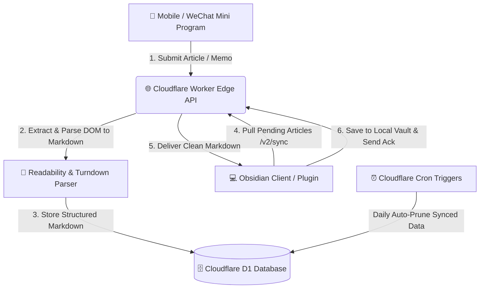

# Obsync (WeChat & Web to Obsidian Sync Engine)

<p align="center">
  <a href="https://community.obsidian.md/plugins/wechat-obsync"></a>
  <a href="https://github.com/less1001/obsync/actions/workflows/ci.yml"></a>
  
  
  
  
</p>

**Obsync** is an open-source, serverless content capture and cross-platform synchronization engine built specifically for the **[Obsidian](https://obsidian.md/)** knowledge base ecosystem. Officially listed in the [Obsidian Community Plugins Directory](https://community.obsidian.md/plugins/wechat-obsync) with **5k+ downloads** and an **Excellent** community health rating.

It empowers knowledge workers, researchers, and writers to seamlessly capture WeChat Official Account articles, web pages, and instant memos on mobile devices, transform them into clean structured Markdown via an edge AST parser, and automatically synchronize them to local Obsidian vaults.

---

## 🌟 Key Features

* **⚡ One-Tap Edge Capture**: Save WeChat articles, web links, or quick memos directly from mobile devices without keeping Obsidian constantly running.
* **📝 Intelligent AST to Markdown Conversion**: Powered by Readability and custom Turndown AST rules to extract pure Markdown with clean frontmatter metadata (title, author, source URL, publish date, tags).
* **☁️ Serverless Edge Architecture**: Deployed globally on Cloudflare Workers and Cloudflare D1 (SQLite) with sub-10ms response times, zero server maintenance, and automated cron data pruning.
* **🔄 Multi-Device Synchronization**: Robust device acknowledgment protocol supporting multiple Obsidian clients (Desktop, Mobile, iPad) concurrently without duplication or data loss.
* **🛡️ Privacy-First & Local-First**: Notes are directly synced into your local Obsidian vault files. Cloud storage functions strictly as a temporary transient sync buffer.

---

## 📐 System Architecture



---

## 📂 Project Structure

```text
obsync/
├── main.ts             # Obsidian plugin core lifecycle & sync commands
├── main.js             # Compiled distribution bundle
├── manifest.json       # Obsidian plugin manifest & metadata (v0.4.10)
├── styles.css          # Plugin UI styling & status indicators
├── src/
│   ├── markdown.ts     # Markdown processing, frontmatter & asset handling
│   └── types.ts        # TypeScript data models and API schemas
├── tsconfig.json       # TypeScript compiler configuration
└── package.json        # Plugin dependencies & build scripts
```

---

## 🚀 Installation & Getting Started

### Option 1: From Obsidian Community Plugins (Recommended)
1. Open Obsidian -> **Settings** -> **Community plugins** -> **Browse**.
2. Search for `WeChat Obsync`.
3. Click **Install**, then **Enable**.

### Option 2: Manual Installation from Release
1. Download `main.js`, `manifest.json`, and `styles.css` from the [Latest Release (v0.4.10)](https://github.com/less1001/obsync/releases/latest).
2. Inside your Obsidian Vault, navigate to `.obsidian/plugins/` and create a folder named `obsync`.
3. Place `main.js`, `manifest.json`, and `styles.css` into `.obsidian/plugins/obsync/`.
4. Reload Obsidian and enable **WeChat Obsync** in settings.

### Option 3: Local Development & Build
1. **Clone the repository**:
   ```bash
   git clone https://github.com/less1001/obsync.git
   cd obsync
   ```
2. **Install dependencies**:
   ```bash
   npm install
   ```
3. **Build the plugin**:
   ```bash
   npm run build
   ```

---

## 🛠️ Tech Stack

* **Client**: Obsidian Plugin API, TypeScript, HTML/CSS
* **Mobile**: WeChat Mini Program Framework (JavaScript, WXML, WXSS)
* **Backend**: Cloudflare Workers, Cloudflare D1 (Serverless SQLite), TypeScript
* **Parsing Engine**: JSDOM, Mozilla Readability, Turndown Service, DOMPurify
* **Validation**: Zod Schemas

---

## 🤝 Contributing

Contributions, issues, and feature requests are welcome! Feel free to check the [issues page](https://github.com/less1001/obsync/issues).

1. Fork the Project
2. Create your Feature Branch (`git checkout -b feature/AmazingFeature`)
3. Commit your Changes (`git commit -m 'Add some AmazingFeature'`)
4. Push to the Branch (`git push origin feature/AmazingFeature`)
5. Open a Pull Request

---

## 📄 License

Distributed under the **MIT License**. See `LICENSE` for more information.
