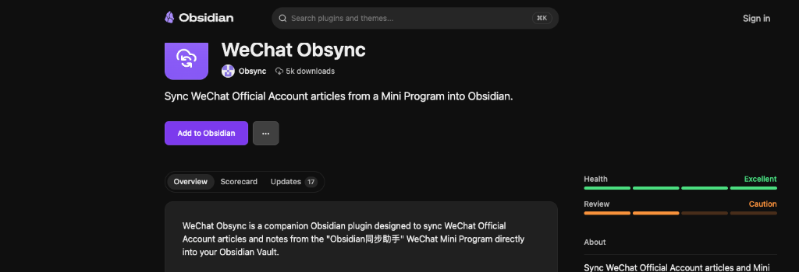
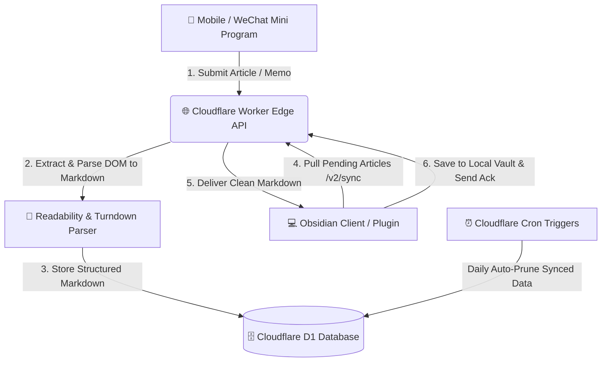

# Obsync (WeChat & Web to Obsidian Sync Engine)

<p align="center">
  <a href="https://community.obsidian.md/plugins/wechat-obsync"></a>
  <a href="https://github.com/less1001/obsync/actions/workflows/ci.yml"></a>
  
  
  
  
</p>

[English](#english) | [中文说明](#-wechat-obsync-微信小程序同步助手中文使用指南)

---

<a name="english"></a>
## English Documentation

**Obsync** is an open-source, serverless content capture and cross-platform synchronization engine built specifically for the **[Obsidian](https://obsidian.md/)** knowledge base ecosystem. Officially listed in the [Obsidian Community Plugins Directory](https://community.obsidian.md/plugins/wechat-obsync) with **5k+ downloads** and an **Excellent** community health rating.

It empowers knowledge workers, researchers, and writers to seamlessly capture WeChat Official Account articles, web pages, and instant memos on mobile devices, transform them into clean structured Markdown via an edge AST parser, and automatically synchronize them to local Obsidian vaults.

<p align="center">
  <a href="https://community.obsidian.md/plugins/wechat-obsync">
    
  </a>
</p>

### 🌟 Key Features

* **⚡ One-Tap Edge Capture**: Save WeChat articles, web links, or quick memos directly from mobile devices without keeping Obsidian constantly running.
* **📝 Intelligent AST to Markdown Conversion**: Powered by Readability and custom Turndown AST rules to extract pure Markdown with clean frontmatter metadata (title, author, source URL, publish date, tags).
* **☁️ Serverless Edge Architecture**: Deployed globally on Cloudflare Workers and Cloudflare D1 (SQLite) with sub-10ms response times, zero server maintenance, and automated cron data pruning.
* **🔄 Multi-Device Synchronization**: Robust device acknowledgment protocol supporting multiple Obsidian clients (Desktop, Mobile, iPad) concurrently without duplication or data loss.
* **🛡️ Privacy-First & Local-First**: Notes are directly synced into your local Obsidian vault files. Cloud storage functions strictly as a temporary transient sync buffer.

### 📐 System Architecture



### 📂 Project Structure

```text
obsync/
├── main.ts             # Obsidian plugin core lifecycle & sync commands
├── main.js             # Compiled distribution bundle
├── manifest.json       # Obsidian plugin manifest & metadata (v0.4.10)
├── styles.css          # Plugin UI styling & status indicators
├── src/
│   ├── markdown.ts     # Markdown processing, frontmatter & asset handling
│   └── types.ts        # TypeScript data models and API schemas
├── tsconfig.json       # TypeScript compiler configuration
└── package.json        # Plugin dependencies & build scripts
```

### 🚀 Installation & Getting Started

#### Option 1: From Obsidian Community Plugins (Recommended)
1. Open Obsidian -> **Settings** -> **Community plugins** -> **Browse**.
2. Search for `WeChat Obsync`.
3. Click **Install**, then **Enable**.

#### Option 2: Manual Installation from Release
1. Download `main.js`, `manifest.json`, and `styles.css` from the [Latest Release (v0.4.10)](https://github.com/less1001/obsync/releases/latest).
2. Inside your Obsidian Vault, navigate to `.obsidian/plugins/` and create a folder named `obsync`.
3. Place `main.js`, `manifest.json`, and `styles.css` into `.obsidian/plugins/obsync/`.
4. Reload Obsidian and enable **WeChat Obsync** in settings.

#### Option 3: Local Development & Build
1. **Clone the repository**:
   ```bash
   git clone https://github.com/less1001/obsync.git
   cd obsync
   ```
2. **Install dependencies**:
   ```bash
   npm install
   ```
3. **Build the plugin**:
   ```bash
   npm run build
   ```

---

<a name="-wechat-obsync-微信小程序同步助手中文使用指南"></a>
## 🇨🇳 WeChat Obsync 微信小程序同步助手（中文使用指南）

**WeChat Obsync** 是一个专门为 Obsidian 设计的微信公众号文章与手机灵感速记同步插件。配合微信小程序 **「Obsidian同步助手」**，它可以将你在手机微信上浏览到的优质长文、精选动态或突发灵感，一键无缝同步到本地 Obsidian 知识库中。

### ✨ 核心功能亮点

- 🚀 **微信文章一键同步**：支持将微信公众号的长图文、视频动态一键同步到你的笔记库，自动转化为排版精美的结构化 Markdown 文件。
- 💡 **灵感速记秒级直达**：在微信小程序中直接输入文字随笔或速记，自动同步保存到 Obsidian。
- 🖼️ **图片本地化防防盗链**：支持自动将文章中的远程图片下载到本地附件文件夹中，彻底告别微信图片防盗链导致的“图裂”问题。
- 📑 **智能元数据 Frontmatter**：自动提取文章标题、原作者、公众号名称、发布日期、原文链接等元数据，并支持自定义 YAML 模板。
- 🔄 **自动防重与多端同步**：内置内容哈希防重机制，支持电脑端、手机端、平板等多台设备同时绑定使用。
- 📊 **状态栏实时看板**：在 Obsidian 底部状态栏实时显示同步状态与最新同步时间。

---

### 📥 安装方法

#### 方法一：从 Obsidian 官方社区插件市场安装（推荐）
1. 打开 Obsidian，进入 **设置** -> **第三方插件** -> **社区插件市场(浏览)**。
2. 在搜索框输入 `WeChat Obsync`。
3. 点击 **安装**，安装完成后点击 **启用**。

#### 方法二：手动离线安装
1. 从 [GitHub Releases 页面](https://github.com/less1001/obsync/releases/latest) 下载最新的 `main.js`、`manifest.json` 和 `styles.css`。
2. 打开你的 Obsidian 笔记仓库，进入 `.obsidian/plugins/` 目录，新建一个名为 `obsync` 的文件夹。
3. 将下载的 3 个文件放入该文件夹中。
4. 重启 Obsidian，在「第三方插件」中启用 `WeChat Obsync`。

---

### 📖 详细使用教程（如何连接微信小程序）

#### 第一步：在 Obsidian 中获取 6 位绑定码
1. 在 Obsidian 中点击左下角 **设置** -> 在左侧找到 **WeChat Obsync** 插件设置页。
2. 在「绑定设备」区域，点击 **生成绑定码** 按钮。
3. 此时屏幕上会显示一个 **6 位数字绑定码**（有效时间为 10 分钟）。

#### 第二步：在手机微信中确认绑定
1. 打开手机微信，搜索并打开小程序 **「Obsidian同步助手」**。
2. 点击小程序底部的 **「设置」** 标签页。
3. 在输入框中填入刚才在电脑上看到的 **6 位绑定码**，点击 **立即绑定**。
4. 提示绑定成功后，手机端与你的本地 Obsidian 库就已建立加密关联！

#### 第三步：开始保存与同步文章
* **方式 A（用小程序打开，最便捷）**：
  在手机微信中阅读任意公众号文章时，点击右上角 **「···」** ➔ 选择 **「用小程序打开」** ➔ 点击 **「Obsidian同步助手」** 即可一键保存！
* **方式 B（复制链接保存）**：
  复制文章链接，打开小程序首页，点击 **「一键读取剪贴板并保存」** 即可。
* **方式 C（灵感速记）**：
  打开小程序首页的「随笔速记」卡片，输入临时想法点击保存。

#### 第四步：在 Obsidian 中查看笔记
* 只要打开 Obsidian，插件便会自动从云端拉取待同步文章，并在几秒钟内将转化好的 Markdown 文件写入你指定的文件夹中！
* 你也可以随时使用快捷键或点击左侧缎带栏的同步图标手动触发即时同步。

---

### ☕ 赞助与支持

如果你觉得这个开源插件对你的知识管理工作流有所帮助，欢迎支持作者持续维护与优化：

- [☕ 在爱发电支持我 (Afdian)](https://ifdian.net/a/vkdefi)

---

### 📄 开源协议 (License)

本项目基于 **MIT License** 开源协议分发与使用。
